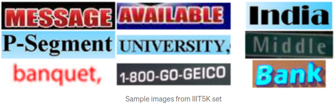

## Compare cloud OCR services. Google Cloud Platform, Amazon Web Services, Microsoft Azure

This is the code for the following [article](https://medium.com/deelvin-machine-learning/a-comparison-of-cloud-solutions-for-optical-character-recognition-ocr-46a24bada58e).

#### Using services  
1. Cloud Vision API (Google)
2. Amazon Rekognition
3. Azure Cognitive Services

#### Data  
In our testing, we used the following 3 datasets containing pictures and annotations:
1. [IIIT5K](http://cvit.iiit.ac.in/research/projects/cvit-projects/the-iiit-5k-word-dataset)  
  
3. [IC13](https://rrc.cvc.uab.es/?ch=2&com=downloads)  
4. [SVHN](http://ufldl.stanford.edu/housenumbers/)  

#### Results  
To compare the OCR accuracy, 500 images were selected from each dataset. Cloud Vision API, Amazon Rekognition, and Azure Cognitive Services results for each image were compared with the ground truth values. The correct result was considered the one that completely coincided with the ground truth, case-insensitive.  
The accuracy was calculated as follows: Accuracy = 100 * correct samples / (correct samples + incorrect samples).  
The table summarizes the results of the accuracy comparison:  

#### Examples  

#### How to run  

