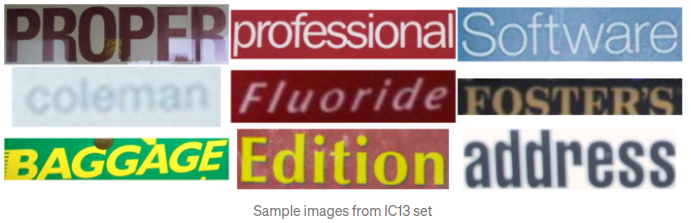
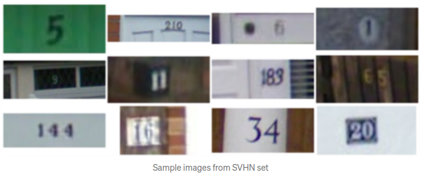
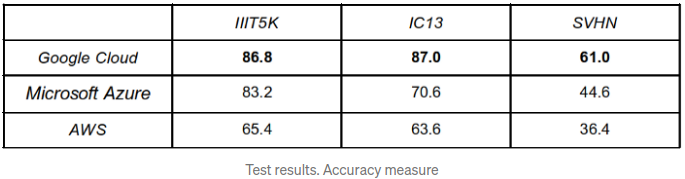
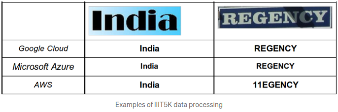
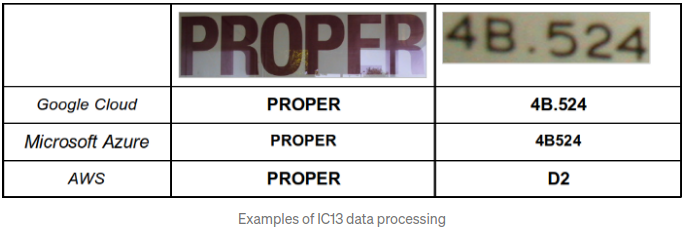
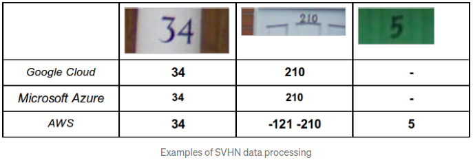

## Compare cloud OCR services. Google Cloud Platform, Amazon Web Services, Microsoft Azure

This is the code for the following [article](https://medium.com/deelvin-machine-learning/a-comparison-of-cloud-solutions-for-optical-character-recognition-ocr-46a24bada58e).

### Using services  
1. Cloud Vision API (Google)
2. Amazon Rekognition
3. Azure Cognitive Services


### Data  
In our testing, we used the following 3 datasets containing pictures and annotations:
1. [IIIT5K](http://cvit.iiit.ac.in/research/projects/cvit-projects/the-iiit-5k-word-dataset)  
  
2. [IC13](https://rrc.cvc.uab.es/?ch=2&com=downloads)  
  
3. [SVHN](http://ufldl.stanford.edu/housenumbers/)  
 

### Results  
To compare the OCR accuracy, 500 images were selected from each dataset. Cloud Vision API, Amazon Rekognition, and Azure Cognitive Services results for each image were compared with the ground truth values. The correct result was considered the one that completely coincided with the ground truth, case-insensitive.  
The accuracy was calculated as follows: Accuracy = 100 * correct samples / (correct samples + incorrect samples).  
The table summarizes the results of the accuracy comparison:  
  
As the results presented in the table demonstrate, among the selected datasets, Google Cloud performs better than Microsoft Azure, and Microsoft Azure performs better than AWS.

### Examples  
Let’s us now demonstrate on several examples how the services in question function and what results they produce. We used the same picture for text recognition in each service.  
  

 

### How to run  
1. Download and unzip datasets to ```data/```  
2. Follow the links in the article to register on the platforms  
3. Run ```python3 test_{platform}.py```  
